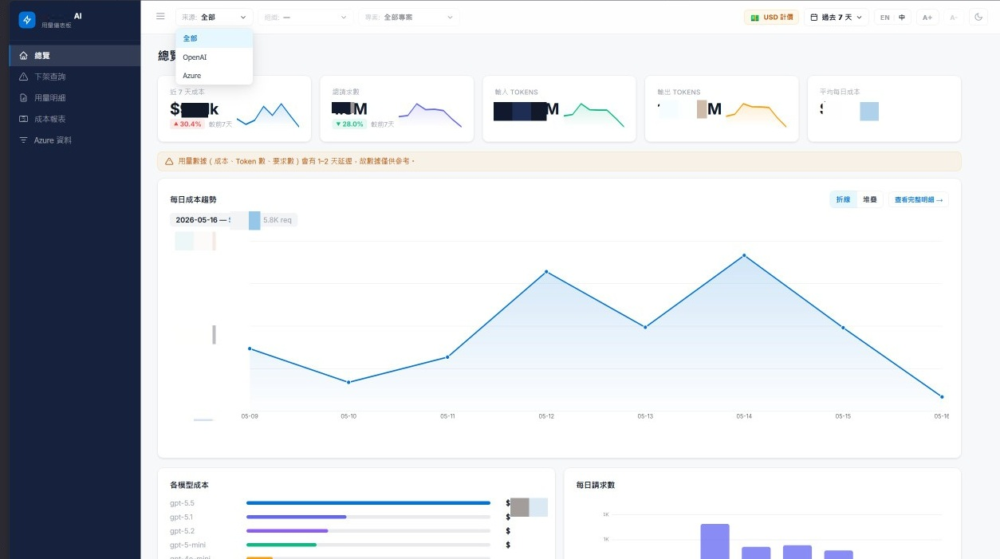

# AI Usage Dashboard

AI Usage Dashboard 是一套自架的 **OpenAI Admin API** 與 **Azure OpenAI** 用量、成本、模型活動與模型下架風險分析儀表板。

後端會把 OpenAI / Azure API 回應以 raw document 形式同步到 MongoDB，再透過 ASP.NET Core API 提供聚合後的資料給靜態 React 儀表板。此專案適合平台、FinOps、AI 基礎設施或內部治理團隊，用來集中觀察 tokens、requests、costs、projects、deployments 與即將下架的模型。

> 目前專案沒有內建 AuthN/AuthZ。若要部署到非本機環境，請先加上存取控制，不要直接暴露到公開網路。

---

## 預覽 Preview



---

## 功能

- OpenAI 與 Azure OpenAI 統一用量與成本總覽。
- OpenAI Admin API usage / cost raw sync。
- Azure subscriptions、Cognitive Services accounts、deployments、Monitor metrics、Cost Management raw sync。
- 用量明細表，支援後端分頁、排序、篩選與分組。
- 成本報表，支援依 project、model、capability、date 拆分。
- Azure 資料瀏覽，支援 accounts、deployments、model usage。
- 模型下架風險儀表板，資料來自 MongoDB catalog。
- CSV 匯出工作佇列。
- 維運 API：checkpoint 查詢、今日重抓、回填、完整重置、warning/error logs。
- 靜態雙語 UI：`zh` / `en`，支援 light / dark mode。

---

## 技術棧

| 層級 | 技術 |
|---|---|
| Backend | ASP.NET Core 8.0 Web API |
| Database | MongoDB，以 raw `BsonDocument` collection 為主 |
| Azure Auth | `Azure.Identity`，支援 `ClientSecretCredential` / `DefaultAzureCredential` |
| OpenAI Auth | OpenAI Admin Key |
| Frontend | React 18 UMD + Babel standalone |
| Charts | 自製 SVG components |
| Tests | xUnit |

C# root namespace 與 solution / project 名稱一致，皆使用 `AI_Usage_Dashboard.*`。

---

## 架構概覽

```text
OpenAI Admin API ─┐
                  ├─► DataFetchWorker ─► *_raw MongoDB collections
Azure ARM/Monitor ┘
Azure Cost API

MongoDB aggregates ─► ASP.NET Core /v1 APIs ─► Static React dashboard
```

核心設計原則：

- Worker services 只同步 raw provider responses 到 `*_raw` collections。
- 下拉選單、名稱、model、capability 都從 raw collections 推導。
- 能用 MongoDB aggregation pipeline 表達的聚合，優先放在 MongoDB。
- Frontend 只渲染後端算好的資料，不做商業邏輯或資料聚合。

完整設計與資料契約請看 [SPEC.md](./SPEC.md)。

---

## 專案結構

```text
.
├─ AI_Usage_Dashboard.sln
├─ AI_Usage_Dashboard/
│  ├─ Controllers/              # /v1 API controllers
│  ├─ Data/                     # MongoDbContext 與 indexes
│  ├─ Models/                   # API DTOs 與 typed metadata models
│  ├─ Services/                 # sync / read / catalog / export / logging services
│  ├─ Utils/                    # date range 與 CSV helpers
│  ├─ Workers/                  # DataFetchWorker
│  ├─ wwwroot/                  # 靜態 React UMD 前端，沒有 build step
│  ├─ Program.cs
│  ├─ appsettings.json          # 只保留安全預設
│  └─ appsettings.example.json
├─ AI_Usage_Dashboard.Tests/
│  └─ DateRangeHelperTests.cs
├─ SECURITY.md
└─ SPEC.md
```

---

## 環境需求

- .NET SDK 8.0+
- MongoDB 6.0+ 建議
- 可連線到：
  - `https://api.openai.com`
  - `https://management.azure.com`
  - Azure Monitor / Cost Management endpoints

前端會從 CDN 載入 React、Babel 與字型；本機開發時瀏覽器也需要能連到 `unpkg.com` 與 Google Fonts。若部署環境不能連外，請自行 vendor 這些靜態資源。

---

## 設定

[AI_Usage_Dashboard/appsettings.json](./AI_Usage_Dashboard/appsettings.json) 只放安全預設。真實 credentials 請透過環境變數、.NET User Secrets、Azure Key Vault、GitHub Actions secrets 或部署平台 Secret Manager 注入。

主要設定：

| Key | 用途 |
|---|---|
| `OpenAI:AdminKey` | OpenAI Admin API key |
| `OpenAI:BaseUrl` | 預設 `https://api.openai.com/v1/` |
| `OpenAI:OrganizationId` | 可選，會同時設定 `OpenAI-Organization` header |
| `MongoDB:ConnectionString` | MongoDB connection string |
| `MongoDB:Database` | Mongo database name |
| `FetchWorker:IntervalMinutes` | worker 主迴圈間隔 |
| `FetchWorker:HistoryDays` | OpenAI 首次同步回填天數 |
| `AzureCost:TenantId` | 可選 Azure service principal tenant |
| `AzureCost:ClientId` | 可選 Azure service principal client id |
| `AzureCost:ClientSecret` | 可選 Azure service principal secret |
| `AzureSnapshot:IntervalMinutes` | Azure snapshot sync 間隔 |
| `AzureSnapshot:UsageWindowDays` | Azure 首次同步回填天數 |
| `CatalogSync:IntervalMinutes` | OpenAI org / user / API key catalog sync 間隔 |
| `Export:Directory` | CSV 匯出目錄 |

PowerShell 範例：

```powershell
$env:OpenAI__AdminKey = "<openai-admin-key>"
$env:OpenAI__OrganizationId = "<optional-openai-org-id>"
$env:MongoDB__ConnectionString = "mongodb://localhost:27017"
$env:MongoDB__Database = "AI_UsageDashboard"

# 可選。三個 AzureCost 值都留空時，會使用 DefaultAzureCredential。
$env:AzureCost__TenantId = "<azure-tenant-id>"
$env:AzureCost__ClientId = "<azure-client-id>"
$env:AzureCost__ClientSecret = "<azure-client-secret>"
```

如果 `AzureCost:TenantId`、`AzureCost:ClientId`、`AzureCost:ClientSecret` 全部為空，系統會使用 `DefaultAzureCredential`。本機開發通常需要先執行 `az login`。

請勿提交真實 API keys、client secrets、private connection strings、certificates、production exports 或本機 `appsettings.*.json`。

---

## 本機啟動

從 repo root 執行：

```powershell
dotnet restore .\AI_Usage_Dashboard.sln
dotnet build .\AI_Usage_Dashboard.sln -c Debug
dotnet run --project .\AI_Usage_Dashboard\AI_Usage_Dashboard.csproj
```

啟動後開啟 Kestrel 輸出的 URL，通常是：

```text
http://localhost:5088/
```

Development 環境會啟用 Swagger：

```text
http://localhost:5088/swagger
```

啟動時系統會：

- 建立 / 確認 MongoDB indexes。
- 在 `deprecation_catalog` 為空時 seed 預設 catalog。
- 啟動 `DataFetchWorker`。
- 啟動 CSV export job service。
- 將 Warning+ logs 寫入 MongoDB `system_logs`。

---

## 測試

```powershell
dotnet test .\AI_Usage_Dashboard.sln
```

目前主要測試：

```powershell
dotnet test .\AI_Usage_Dashboard.Tests\AI_Usage_Dashboard.Tests.csproj --filter "FullyQualifiedName~DateRangeHelperTests"
```

現有自動化測試覆蓋率偏低，主要集中在 date range 行為。若修改 aggregation、controller contracts 或 sync checkpoint 行為，建議補 integration tests。

---

## 前端開發

前端沒有 npm、bundler 或 build step。

直接編輯：

```text
AI_Usage_Dashboard/wwwroot/
```

主要檔案：

| File | 用途 |
|---|---|
| `index.html` | App shell、global state、page routing |
| `api.js` | `window.API` fetch wrapper |
| `i18n.js` | `zh` / `en` translations |
| `layout.jsx` | Sidebar、header、date picker、shared primitives |
| `overview.jsx` | KPI 與 trend dashboard |
| `usage-detail.jsx` | Usage table |
| `cost-report.jsx` | Cost breakdown pages |
| `deprecated-models.jsx` | Deprecated model dashboard |
| `azure-page.jsx` | Azure raw data browser |
| `charts.jsx` | SVG chart components |

JSX 由瀏覽器端 Babel standalone 編譯，修改後重新整理頁面即可。

---

## 主要 API

所有 API 都在 `/v1` 底下，JSON 欄位使用 camelCase。

| 區塊 | Endpoint |
|---|---|
| Usage overview | `GET /v1/usage/overview` |
| Usage trend | `GET /v1/usage/trend` |
| Usage records | `GET /v1/usage/records` |
| Usage filters | `GET /v1/usage/filters` |
| Cost breakdown | `GET /v1/cost/breakdown` |
| Cost stacked trend | `GET /v1/cost/trend-stacked` |
| Orgs / subscriptions | `GET /v1/orgs` |
| Projects / accounts | `GET /v1/projects` |
| Deprecated models | `GET /v1/models/deprecated` |
| Deprecation catalog | `GET /v1/models/deprecation-catalog` |
| Azure status | `GET /v1/azure/status` |
| Azure overview | `GET /v1/azure/overview` |
| Azure query | `GET /v1/azure/query` |
| Budgets | `GET /v1/budgets`, `PUT /v1/budgets/{projectId}` |
| Alerts | `GET /v1/alerts` |
| Export | `POST /v1/export`, `GET /v1/export/{jobId}` |
| Maintenance | `GET /v1/maintenance/checkpoints` |

日期參數統一透過 `DateRangeHelper.ResolvePeriod` 解析。API 邊界上的 `endDate` 視為 inclusive，內部會轉成 exclusive upper bound。

---

## 背景同步

`DataFetchWorker` 會依排程協調下列 sync services：

| Source | Service | Output |
|---|---|---|
| OpenAI usage | `OpenAiUsageRawSync` | `openai_usage_raw` |
| OpenAI costs | `OpenAiCostsRawSync` | `openai_costs_raw` |
| OpenAI catalog | `OpenAiCatalogRawSync` | `openai_orgs_raw`, `openai_users_raw`, `openai_api_keys_raw` |
| Azure subscriptions / locations / accounts / deployments / usages | `Azure*RawSync` services | `azure_*_raw` collections |
| Azure Monitor metrics | `AzureMetricsRawSync` | `azure_metrics_raw`, `azure_metric_defs_raw` |
| Azure Cost Management | `AzureCostRawSync` | `azure_cost_raw` |

同步 checkpoint 存在 `fetch_checkpoints`。可用 maintenance endpoints 進行重抓、回填或完整重置。

---

## MongoDB Collections

Raw collections 儲存 provider responses 與必要 sync dimensions：

- `openai_usage_raw`
- `openai_costs_raw`
- `openai_orgs_raw`
- `openai_users_raw`
- `openai_api_keys_raw`
- `azure_subscriptions_raw`
- `azure_locations_raw`
- `azure_accounts_raw`
- `azure_deployments_raw`
- `azure_usages_raw`
- `azure_metric_defs_raw`
- `azure_metrics_raw`
- `azure_cost_raw`

Typed metadata collections：

- `budgets`
- `alert_events`
- `export_jobs`
- `fetch_checkpoints`
- `deprecation_catalog`
- `system_logs`

Indexes 由 `MongoDbContext.EnsureIndexesAsync()` 在啟動時建立。

---

## 安全注意事項

部署到本機以外的環境前，至少應補上：

- Authentication / Authorization，建議 SSO/JWT + RBAC。
- 嚴格 CORS origins。
- Rate limiting。
- Maintenance、budget、export、catalog mutation endpoints 的 audit logs。
- 透過 managed secret store 管理 secrets。
- MongoDB network isolation。
- Export file 存取控制與保留期限。

Secret handling 請參考 [SECURITY.md](./SECURITY.md)。

---

## 已知限制

- 無內建 AuthN/AuthZ。
- raw usage / cost / metrics collections 目前沒有 TTL，資料會持續累積。
- 測試覆蓋率目前偏低。
- `budget-alert.jsx` 存在，但沒有接到 app shell。
- `docs-page.jsx` 是內嵌架構頁，內容可能落後 [SPEC.md](./SPEC.md)。
- Azure / OpenAI provider API 不一定提供 model-level cost，因此部分成本歸因採 token-share allocation。

---

## 授權 License

本專案採用 [Apache License 2.0](./LICENSE) 授權。

This project is licensed under the [Apache License 2.0](./LICENSE).
